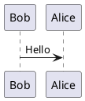

# まえがき {.unnumbered}
このドキュメントは、筆者が本を書くために構築したオレオレMarkdown-PDF変換環境
を解説するための本です。^[このドキュメント自身もその環境で出力されました。よくあることですね]

筆者が以前使っていたGitBookでは表の扱いなどに制限があり不満があったので、
「なければ作る」の原則に従ってみました。

使用OSはUNIXを前提にします。具体的に言うとMac、LinuxならUbuntu16.04LTSです。
Windows10とWSLなUbuntuならUbuntu16.04のやり方がうまくいくと思います^[Creators Updateの適用が必要]。
Win10機は持っているのですが、当該機がとっても遅い[^i5-2500Kかつメインディスクが2.5インチHDDでして]
ので検証が進まず、あまり良いアドバイスができません。ごめんなさい。

## 背景というか、どうやって変換するの？
最終的にはシンプル３ステップで出力されます。原稿はMarkdown形式です。

1. Markdownで原稿を書きます
1. コンパイルします
1. PDFが出力されます

コンパイルの制御にはGNU Makeを使います。コンパイルの前処理としてGPPによる原稿の連結を行い[^gpp]、
各種YAMLデータ[^yaml2json]から画像もしくは表を生成し[^pandable][^pandoc-imagine][^wavedrom][^bitfield]、
最後にMarkdownをPDFもしくはHTMLに出力します[^pandoc][^make-html][^make-pdf]。

[^gpp]: @sec:gpp
[^yaml2json]: yaml2json
[^pandable]: @sec:pantable
[^pandoc-imagine]: pandoc-imagine
[^wavedrom]: wavedrom
[^bitfield]: @sec:bitfield
[^pandoc]: @sec:pandoc
[^make-html]: make html
[^make-pdf]: make pdf

Markdownコンパイラは**Pandoc**^[マニュアルを日本語化している有志の方がいますね]と各種フィルタを使います。
各種フィルタはあちこちから都合のいいものをかき集めてるので**_使用言語がバラバラです_**。
Homebrewあるいはaptでインストールすれば _比較的_ 楽ちんなので筆者は気にせずに構築してきましたが、
Windowsはこのあたりが非常にめんどいのでMacまたはUbuntuの使用をおすすめします。
プロいひとはDockerイメージとかCIとかでもっと楽にできるかもしれません。

# 環境構築する
やることはいっぱいあります。~~やっぱりDockerイメージ欲しいな()~~

## インストールそしてインストールそれからインストール
インストールしまくります。

### パッケージ管理ツールのインストール

#### Homebrew(Mac)
https://brew.sh/index_ja.html

全てに先んじてHomebrewのインストールをします。
```sh
$ /usr/bin/ruby -e "$(curl -fsSL https://raw.githubusercontent.com/Homebrew/install/master/install)"
```
Ubuntuユーザはaptがほぼ全てやってくれるので特別にインストールするものはありません

### 言語のインストール
主に４言語使います - **Haskell・Python _３_・NodeJS・LaTeXです**^[_もううんざりしてきた？_]。
HaskellはPandocとpandoc-crossrefフィルタのインストールで必要です。NodeJSはフィルタと画像生成、
Pythonはフィルタとシェルスクリプトの代わり、そしてLaTeXはPDF出力のためです。

#### Mac {.unnumbered}
```sh
$ brew install cabal-install
$ brew install python3
$ brew install nodebrew
$ nodebrew use v6.5.0
$ brew cask install mactex
```

#### Ubuntu {.unnumbered}
```sh
$ sudo apt-get install python3 python3-pip
$ sudo apt-get install nodejs-legacy npm
$ sudo apt-get install texlive-xetex
```

[https://texwiki.texjp.org/?TeX%20Live]

### 各言語のパッケージのインストール
#### Mac {.unnumbered}
```sh
$ cabal install pandoc-crossref
$ pip3 install pyyaml pillow
$ pip3 install pantable csv2table
$ pip3 install six pandoc-imagine
$ npm install -g phantomjs-prebuilt bit-field wavedrom-cli
```
pandoc-crossrefがpandocに依存しているので自動的にインストールされます。

#### Ubuntu {.unnumbered}
aptで入るpandocは1.16でだいぶ古いのでpandocのGitHubサイト^[https://github.com/jgm/pandoc/releases]
からdebファイルを落としてきます
```sh
$ wget -c https://github.com/jgm/pandoc/releases/download/1.19.2.1/pandoc-1.19.2.1-1-amd64.deb
$ sudo dpkg -i pandoc-1.19.2.1-1-amd64.deb
$ sudo -H pip3 install pyyaml pillow
$ sudo -H pip3 install pantable csv2table
$ sudo -H pip3 install six pandoc-imagine
$ sudo npm install -g phantomjs-prebuilt wavedrom-cli
$ sudo npm install -g fs-extra yargs onml bit-field
$ sudo apt-get install xzdec texlive-lang-japanese
$ tlmgr init-usertree
$ tlmgr option repository ftp://tug.org/historic/systems/texlive/2015/tlnet-final
$ wget -c https://github.com/zr-tex8r/BXptool/archive/v0.4.zip
$ unzip v0.4.zip
$ sudo mkdir -p /usr/share/texlive/texmf-dist/tex/latex/BXptool/
$ sudo cp BXptool-0.4/bx*.{sty,def} /usr/share/texlive/texmf-dist/tex/latex/BXptool/
$ sudo mktexlsr
$ tlmgr install oberdiek
```
<!--
#### TeXLive
https://github.com/zr-tex8r/BXptool
```sh
$ sudo apt-get install xzdec texlive-lang-japanese
$ tlmgr init-usertree
$ tlmgr option repository ftp://tug.org/historic/systems/texlive/2015/tlnet-final
$ wget -c https://github.com/zr-tex8r/BXptool/archive/v0.4.zip
$ unzip v0.4.zip
$ sudo mkdir -p /usr/share/texlive/texmf-dist/tex/latex/BXptool/
$ sudo cp BXptool-0.4/bx*.{sty,def} /usr/share/texlive/texmf-dist/tex/latex/BXptool/
$ sudo mktexlsr
```
 -->
### ツールのインストール
#### Mac {.unnumbered}
```sh
$ brew install librsvg gpp plantuml wget
```
#### Ubuntu {.unnumbered}
```sh
$ sudo apt-get install librsvg2-bin gpp
$ sudo apt-get install graphviz plantuml
```
### フォントのインストール
各リポジトリからアーカイブをダウンロード・解凍してTTFファイル(TrueTypeフォント)を全部、
ユーザフォントディレクトリにコピーします。
```sh
mkdir -p $HOME/.local/share/fonts/
cd $HOME/.local/share/fonts/
wget -c https://github.com/adobe-fonts/source-code-pro/archive/2.030R-ro/1.050R-it.zip
wget -c https://github.com/adobe-fonts/source-sans-pro/archive/2.020R-ro/1.075R-it.zip
wget -c https://github.com/mzyy94/RictyDiminished-for-Powerline/archive/3.2.4-powerline-early-2016.zip
```

## ダウンロード
### pandoc_misc
この本の原稿が置かれたリポジトリです。`$(HOME)/.pandoc`にクローンします。
```sh
$ cd ~/.pandoc
$ git clone https://github.com/K4zuki/pandoc_misc.git
$ git submodule update --init
$ cd bitfield
$ npm install
```

# 本を書く
## 原稿リポジトリの準備
新規に原稿管理用Gitリポジトリを作りましょう。たとえば
ホームディレクトリ直下のworkspaceディレクトリにMyBookというGitリポジトリを作ります。
```sh
$ mkdir -p ~/workspace/MyBook
$ cd ~/workspace/MyBook
$ git init
```
ここでpandoc_miscディレクトリに戻り、原稿リポジトリにコンパイル環境をコピーします。
```sh
$ cd ~/.pandoc/pandoc_misc
$ make init PREFIX=~/workspace/MyBook
```
初期状態では以下のようなディレクトリ構成のはずです。
```
~/workspace/MyBook
|-- Makefile
|-- Out/
|-- images/
|-- markdown/
|   |-- TITLE.md
|   `-- config.yaml
`-- data/
    |-- bitfields/
    |-- bitfield16/
    `-- waves/
```

## 原稿リポジトリの調整
原稿のファイル名・置き場所・ディレクトリ構成は自由に配置してください。日本語ファイル名は
問題ないと思います^[推奨しません]が、スペースを入れるのは避けるべきです。

### ファイル名・ディレクトリ名の設定(Makefile)
タイトルファイル名、ディレクトリ名を変更した場合は、そのことをコンパイラに知らせる必要があります。
コンパイラはタイトルページのファイル名と各種ディレクトリ名をMakefileから取得します。
ディレクトリ名はすべてMakefileが置かれたディレクトリからの相対パスです。

```table
---
caption: Makeコンパイルオプション
width:
  - 0.15
  - 0.2
  - 0.55
  - 0.1
header: True
---
変数名,種類,意味,初期値
CONFIG,ファイル,pandocのコンフィグファイル,config.yaml
INPUT,ファイル,タイトルファイル,TITLE.md
TARGET,ファイル,出力ファイル,TARGET
MDDIR,ディレクトリ,タイトルファイルの置き場所,markdown/
DATADIR,ディレクトリ,データディレクトリ,data/
TARGETDIR,ディレクトリ,出力先ディレクトリ,Out/
IMAGEDIR,ディレクトリ,画像ファイルの置き場所,images/
WAVEDIR,ディレクトリ,WaveDromファイルの置き場所,waves/
BITDIR,ディレクトリ,８ビット幅Bitfieldファイルの置き場所,bitfields/
BIT16DIR,ディレクトリ,１６ビット幅Bitfieldファイルの置き場所,bitfield16/
```

### Pandocオプションの設定(config.yaml)
Pandocはmarkdownファイル内のYAML FrontMatterもしくは独立したYAMLファイルから
コンパイルオプションを取得します。
```table
---
caption: Pandocコンパイルオプション
header: True
markdown: True
width:
  - 0.2
  - 0.5
  - 0.3
---
パラメータ,意味,初期値
title,タイトル,本のタイトル
abstract,サブタイトル,本の概要
circle,サークル名,サークル名
author,作者の名前,本の作者
comiket,イベント名,コミケ
year,発行年,出版年
publisher,印刷所,出版社で印刷製本
docrevision,リビジョン番号,1.0
front,表紙画像ファイル名,images/front-image.png
```

## 原稿リポジトリをコンパイル
ここでいったんコンパイルできるかどうか試してみましょう。`TITLE.md`の中身が空でも
コンパイルすることはできます。コンパイルする前に`Makefile`/`config.yaml`と
原稿一式をリポジトリに登録して最初のコミットをします。
```sh
$ git add .
$ git commit -m"initial commit"
```
この状態で`make html`とすると`Out/TARGET.html`というファイルができあがるはずです。
以下に代表的なコマンドの一覧を載せます。
`````table
---
caption: コンパイル方法
markdown: True
---
コマンド,効果,成果物
`make html`,HTMLファイル生成,`$(TARGETDIR)/$(TARGET).html`
`make pdf`,PDFファイル生成,`$(TARGETDIR)/$(TARGET).pdf`
`make clean`,成果物を全部消去,"
```
rm -rf $(TARGETDIR)/*\\
rm -rf $(IMAGEDIR)/$(WAVEDIR)/\\
rm -rf $(IMAGEDIR)/$(BITDIR)/\\
rm -rf $(IMAGEDIR)/$(BIT16DIR)/
```
"
`````

## 原稿を書く {#sec:pandoc}
これでとりあえずコンパイルが通るようになったので、実際の原稿を書けるようになりました。
~~**デファクトスタンダードこと**~~Pandoc式Markdown記法に則って書いていきます。

### ヘッダの書き方
デフォルトの`config.yaml`では章番号がつく設定で、例外的に消すこともできます。
例外が適用できるのは深さ４までの章番号に限られ、深さ５より深いものは _無条件に_ ナンバリングされます。
```markdown
# 深さ1：章番号なし {.unnumbered}
## 深さ2：章番号なし {.unnumbered}
### 深さ3：章番号なし {.unnumbered}
#### 深さ4：章番号なし {.unnumbered}
##### 深さ5+：章番号復活 {.unnumbered}
```

### 原稿を連結する {#sec:gpp}
原稿の連結にはGeneric Preprocessor^[https://github.com/logological/gpp]を使います。
C言語で＃`include "stdio.h"`などと記述するアレです。
C言語風そのままだとヘッダと間違われるのでHTML風に&lt;＃`include "ファイル名"`&gt;
と記述します。該当部分は指定されたファイルに
置き換えられます(入れ子になっていても機能します)。

### 表を書く・引用する {#sec:pantable}
表の引用とレンダリングにはpantableフィルタ^[https://github.com/ickc/pantable]を使います。
コードブロックに直接CSVを書くか、`include: ファイル名`でファイル名を指定します。
タイトルの有無やCSVセルの内容をMarkdownとして解釈するかどうか
を選択するオプションがあります。１セルが複数行に渡る表も書けます。
`include` でファイルを指定しているときは直接記述部分は無視されます。
```table
---
caption: pantableフィルタオプション（抜粋）
markdown: True
---
オプション,省略可能,デフォルト値,意味
caption,Y,,表のタイトル。Markdown記法が使える
include,Y,,CSVファイル名
markdown,Y,False,セルの内容をMarkdownとして解釈するフラグ
alignment,Y,,列ごとの右揃え(R)/左揃え(L)/中央揃え(C)/デフォルト(D)の指定
table-width,Y,1.0,表全体の幅 ページ幅に対する比率で指定する(ページ幅いっぱいが1.0)
```

#### 記述例 {.unnumbered}
~~~~~markdown
```table
---
caption: '*Awesome* **Markdown** Table'
alignment: RCDL # Right, Center, Default, Left
table-width: 0.6 # default is 1.0 * page width
markdown: True # inline markdown
include: "data/table.csv" # eternal file
---
```
~~~~~

#### CSVファイルの中身 {.unnumbered}
```listingtable
source: data/table.csv
class: csv
tex: True
---
```

#### 変換結果 {.unnumbered}
```table
---
caption: '*Awesome* **Markdown** Table'
alignment: RCDL
table-width: 0.6
markdown: True
include: "data/table.csv"
---
```

### ソースコードを引用する {#sec:listingtable}
ソースコードの引用とレンダリングにはPythonで組んだ自作フィルタ^[`pandoc_misc/panflute/ListingTable.py`]
を使います。

```table
---
caption: ListingTableフィルタオプション
markdown: True
---
オプション,省略可能,デフォルト値,意味
source,N,,ソースファイル名(フルパス)
class,N,,"ソースファイル種類(python,cpp,markdown etc.)"
tex,Y,False,LaTeXを出力するとき"True"にする。case sensitive
```

### ビットフィールド画像を描く {#sec:bitfield}
```table
---
caption: BitFieldフィルタオプション
markdown: True
width:
  - 0.25
  - 0.25
  - 0.25
  - 0.25
alignment: DCCC
---
オプション,省略可能,デフォルト値,意味
input,N,,ソースファイル名
png,Y,True,PNG出力フラグ
eps,Y,False,EPS出力フラグ
pdf,Y,False,PDF出力フラグ
lane-height,Y,80,レーンあたりの高さ
lane-width,Y,640,レーンの幅
lanes,Y,1,レーンの数
bits,Y,8,総ビット数
fontfamily,Y,"source code pro",フォントファミリ名
fontsize,Y,16,フォントサイズ
fontweight,Y,normal,フォントのウェイト
caption,Y,Untitled,タイトル
directory,Y,"`./svg`",出力ディレクトリ
```

~~~~~markdown
```bitfield
input: Out/bit.bitjson
---
```
~~~~~

```bitfield
input: Out/bit.bitjson
---
```

### ロジック波形を描く
### その他各種レンダラを使う
他にもPlantUML,Mermaid,GNU Plotなどの画像レンダラをを仲介するPandocフィルタを使うことができます。
種類があまりにも多くてPlantUML以外未テストですが、
Imagineフィルタ^[https://github.com/hertogp/imagine]を使えばコードブロックから
画像生成が可能です。

- <http://qiita.com/mitsugu/items/014e13ca0696c7c53d4c>

~~~~~markdown

~~~~~


```{.plantuml im_out="fcb,img" caption="Created by plantuml"}
**@startuml
scale 580*690
title Servlet Container
(*) --> "ClickServlet.handleRequest()"
--> "new Page"
if "Page.onSecurityCheck" then
->[true] "Page.onInit()"
if "isForward?" then
->[no] "Process controls"
if "continue processing?" then
-->[yes] ===RENDERING===
else
-->[no] ===REDIRECT_CHECK===
endif
else
-->[yes] ===RENDERING===
endif
if "is Post?" then
-->[yes] "Page.onPost()"
--> "Page.onRender()" as render
--> ===REDIRECT_CHECK===
else
-->[no] "Page.onGet()"
--> render
endif
else
-->[false] ===REDIRECT_CHECK===
endif
if "Do redirect?" then
->[yes] "redirect request"
--> ==BEFORE_DESTROY===
else
if "Do Forward?" then
-left->[yes] "Forward request"
--> ==BEFORE_DESTROY===
else
-right->[no] "Render page template"
--> ==BEFORE_DESTROY===
endif
endif
--> "Page.onDestroy()"
-->(*)
@enduml
```

### 画像を回転する

<!-- ############################################################################## -->
<!-- ############################################################################## -->
<!-- ############################################################################## -->
<!-- ############################################################################## -->
<!-- ############################################################################## -->
<!-- ############################################################################## -->
<!-- ############################################################################## -->
<!-- ############################################################################## -->
<!-- ############################################################################## -->
<!-- ############################################################################## -->
<!-- ############################################################################## -->
<!-- ############################################################################## -->
<!-- ############################################################################## -->
<!-- ############################################################################## -->
<!-- ############################################################################## -->
<!-- ############################################################################## -->
<!-- ############################################################################## -->

# 必要なもの
## pandoc
汎用Markdownコンバータ

### インストール
- Mac
```sh
$ brew install pandoc pandoc-crossref
```
- Ubuntu
    - aptで入るのは1.16でだいぶ古いのでpandocのGitHubサイトからdebファイルを落としてくる
```sh
$ wget -C https://github.com/jgm/pandoc/releases/download/1.19.2.1/pandoc-1.19.2.1-1-amd64.deb
$ dpkg -i pandoc-1.19.2.1-1-amd64.deb
```

## GNU Make
全体のコンパイルに必要

### syntax
#### 生成物を消去
`$ make clean`{.sh}

#### pandoc(HTML出力)
`$ make html`{.sh}

#### pandoc + XeLaTeX(PDF出力)
`$ make pdf`{.sh}

## Python _3_

- データ変換とpandocフィルタに必要
- **やはりPython２は悪い文明！粉砕する！**

### インストール
- Mac
    - `$ brew install python3`{.sh}
- Linux
    - `$ sudo apt-get install python3 python3-pip`{.sh}
        - このpip3はパーミッションエラーを引き起こすようなのでアップグレードするべきではない
        - もしくはプレフィックス付きでアップデートしなければならない（けどやり方は知らない）

### ワンライナーYAML - JSON コンバータ {#yaml2json}

~~一部~~殆どのJSライブラリが _当然のように_ JSONを利用するが、JSONはバイナリでもないのに
人間に読めない形式なのでYAMLでデータを作り、それをワンライナーでJSONに変換する前処理をして、
それらのライブラリに渡す。みんなしあわせ

- `$ pip3 install pyyaml`{.sh}

Makefileの中に直接記述

```makefile
PYWAVEOPTS:= -c
PYWAVEOPTS += 'import sys, yaml, json; \
							json.dump(yaml.load(sys.stdin), \
              sys.stdout, indent=4)'

python3 $(PYWAVEOPTS) < $< > $@
```

### pantable
CSVファイルをpandocのgrid tableに変換して取り込む。以前は自作スクリプトを使用していたが廃止。

<https://github.com/ickc/pantable>

#### インストール
```sh
$ pip3 install pantable
```

#### 書式
`table`クラスのコードブロック内にYAMLヘッダを記述する。外部ファイルをインポートすることも直書きもできる。

~~~~~markdown
```table
---
caption: '*Awesome* **Markdown** Table'
alignment: RCDL # Right, Center, Default, Left
table-width: 2/3 # default is 1.0 * page width
markdown: True # inline markdown
include: "data/table.csv" # eternal file
---
```
~~~~~
- csv file

```listingtable
source: data/table.csv
class: csv
tex: True
---
```

- result
```table
---
caption: '*Awesome* **Markdown** Table'
alignment: RCDL
table-width: 2/3
markdown: True
include: "data/table.csv"
---
```

### rotateimg.py(自作フィルタ)
`pantable`と同様の書式で画像を任意角度で回転する。
内部でPillowライブラリを利用している。

#### インストール
```sh
$ pip3 install pillow
```

#### 書式
~~~~~markdown
```rotate
source: images/waves/wave.png
angle: 45
# title: 'Alt title'
caption: 任意角度（45度）で回転させたWaveDrom画像
attr:
#  width: 20%
#  height: 50%
---
```
~~~~~
```rotate
source: images/waves/wave.png
angle: 45
# title: 'Alt title'
caption: 任意角度（45度）で回転させたWaveDrom画像
attr:
#  width: 20%
#  height: 50%
---
```

### include.py(自作フィルタ)

    `path/to/filename.file`{command}

の書式で各種ファイルをインポートするためのpandoc前段フィルタ。

#### ソースコードなどをリストとして表にする

`<extention>`に合わせたマークアップが施される

| type         | command                        |
|--------------|--------------------------------|
| source codes | `.listingtable .<extention>` |

## Node.js と npm

更新頻度高すぎ\&\&ワケワカラン過ぎてあんまり好きじゃない。
偶数バージョンがLTSらしいので当面Macは**6系**を使用。Ubuntu16.04は**4系**のLTSが入る

`npm install`は`-g`なしだと現在のディレクトリにインストールしちゃうオモシロ仕様なのでつけるのを忘れずに

### インストール
- Mac
```sh
$ brew install nodebrew
$ nodebrew use v6.5.0
~/.nodebrew/current/bin/{node,npm}
```
- Ubuntu
```sh
$ sudo apt-get install nodejs-legacy npm
```

### wavedrom
#### インストール

- Mac
```sh
$ npm install -g wavedrom-cli
```
- Ubuntu
```sh
$ sudo npm install -g wavedrom-cli
```
#### 使用例
`$ make wavedrom` → 波形画像をYAMLから[コンバータ](#yaml2json)を通して生成

```listingtable
source: data/waves/wave.yaml
class: yaml
tex: True
---
```

```sh
$ python -c \\
  'import sys, yaml, json; json.dump(yaml.load(sys.stdin),
  sys.stdout, indent=4)' < data/waves/wave.yaml > Out/wave.wavejson
$ phantomjs /Users/yamamoto/.nodebrew/current/bin/wavedrom \\
  -i Out/wave.wavejson -p images/waves/wave.png
```

### bit-field / librsvg
#### インストール

- bit-field
    - `$ npm install -g bit-field`{.sh}
    - `$ sudo npm install -g bit-field`{.sh}

- librsvg
  - Mac
```sh
$ brew install librsvg
```
  - Ubuntu
```sh
$ sudo apt-get install librsvg2-bin
```

#### 使用例

`$ make bitfield` → レジスタ構成画像をYAMLから[コンバータ](#yaml2json)を通して生成

```makefile
$(BITFIELD) --input $< --vspace 80 --hspace 640 --lanes 1 --bits 8 > $<.svg
rsvg-convert $<.svg --format=png --output=$@
```

```listingtable
source: data/bitfields/bit.yaml
class: yaml
tex: True
---
```


### mermaid-filter
<https://github.com/raghur/mermaid-filter>

#### インストール

- `$ npm install -g mermaid raghur/mermaid-filter`
- `$ sudo npm install -g mermaid raghur/mermaid-filter`

#### syntax
```markdown
~~~{.mermaid loc=images}
sequenceDiagram
    Alice->>John: Hello John, how are you?
    John-->>Alice: Great!
~~~
```
#### オプション(リポジトリREADMEより)

> You have a couple of formatting options via attributes of the fenced code block to control the rendering
>
> - Image Format - Use ```{.mermaid format=svg} Default is png
> - Width - Use ```{.mermaid width=400} default with is 500
> - Save path - Use ```{.mermaid loc=img} default loc=inline which will encode the image in a data uri scheme.
>     - Possible values for loc
>         - loc=inline - default; encode image to data uri on img tag.
>             - For widest compatibility, use png (default)
>             - SVG has trouble on IE11
>         - loc=imgur - upload png to imgur and link to it.
>         - loc=\\<anythingelse\\> - treat as folder name to place images into

## GPP (Generic Preprocessor) 汎用プリプロセッサ
C言語などの`＃include "stdio.h"`{.c}と同様のことができる。そのままではヘッダ記述を誤解されるので
HTML形式を使用する。

### インストール

- Ubuntu - `$ apt-get install gpp`{.sh}
    - 日本語ファイル使える
- Mac - `$ brew install gpp`{.sh}
    - 日本語ファイル使える
- Windows - https://github.com/makc/gpp.2.24-windows からコンパイル済バイナリを入手
    - 日本語ファイル使える

### syntax

`＜＃include "source.md"＞` で外部ファイル読み込み(`-H` オプション)

HTMLのコメントが使えるように`+c "＜!--" "--＞"`オプションを使用

### options

```sh
gpp -H +c "＜!--" "--＞"
```

# 使用例 {.unnumbered}
`$ this is a code`{.sh}

```cpp
ThisIsAnother(){
  code_block();
}
```


<!-- `images/waves/wave.png`{.rotate .caption="任意角度（90度）で回転させたWaveDrom画像" .angle=90}{} -->
```rotate
source: images/waves/wave.png
angle: 90
# title: 'Alt title'
caption: 任意角度（90度）で回転させたWaveDrom画像
---
```
```rotate
source: images/waves/wave.png
angle: 45
# title: 'Alt title'
caption: 任意角度（45度）で回転させたWaveDrom画像
---
```


<#include "source.md">
